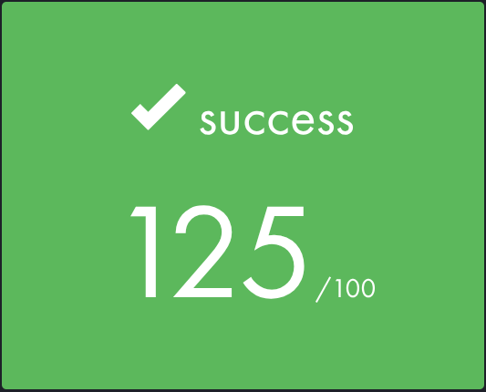
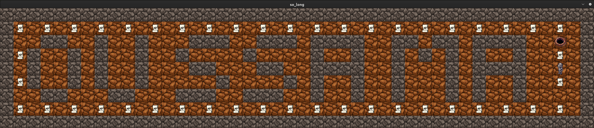
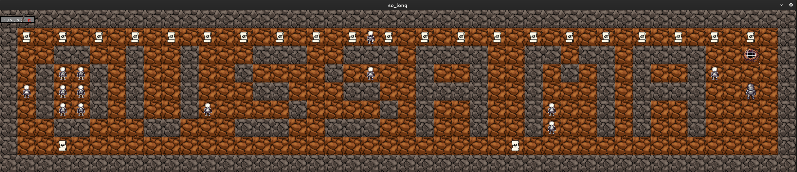

# so_long 🎮 - 42 School Project - 1337 KH


A 2D game created with **MiniLibX** as part of the 42 School curriculum. Collect all items and escape the maze!

---

## Overview

**so_long** is a 2D game developed using **MiniLibX** as part of the 42 School curriculum. The objective is to navigate a maze, collect all items, and reach the exit. This project emphasizes **graphics programming**, **map parsing**, **event handling**, and **memory management**.

---

## Screenshots 🖼️

<div align="center">
  
</div>

- **Mandatory**

<div align="center">
  
</div>

- **Bonus**

<div align="center">
  
</div>

---

## Features

- **Map validation** for `.ber` files with custom rules
- **Dynamic rendering** of sprites and animations
- **Player movement** using `WASD` keys
- **Collectible system** with an on-screen counter
- **Win/lose conditions** (collect all items to unlock the exit)
- **Error handling** for invalid maps, paths, or assets
- **Cross-platform compatibility** (Linux with MiniLibX)

---

## How It Works

The game uses **MiniLibX** for graphics and follows these rules:
1. The player (`P`) must collect all items (`C`) without get killed by (`V`) to unlock the exit (`E`).
2. The map must be enclosed by walls (`1`).
3. Movement count is displayed in the terminal.
4. Press `ESC` to quit or close the window to exit.

### Map Requirements:
- Rectangular layout
- Valid components: `0` (empty), `1` (wall), `C` (collectible), `E` (exit), `P` (player), `V` (enemy)
- At least 1 collectible and 1 enemy , Should be 1 exit and 1 player
- Surrounded by walls
- Valid Path like Collectible or exit or player must be not surrounded by walls.
- File Name anythine end with `.ber`
---

## Installation

# Before Clone you must have mlx library :
-	You Should set on your /home/$(USER)/
-	modifie in Headers
-	set up what should to compile

1. Clone the repository:
```bash
git clone https://github.com/oussama-fa/so_long_42.git
cd so_long_42
```

2. Compile the game:

- ``Mandatory`` :

```bash
make
```

- ``Bonus`` :

```bash
make bonus
```

3. Run with a map file:

- ``Mandatory`` :

```bash
./so_long Mandatory/maps/map1.ber
```

- ``Bonus`` :
```bash
./so_long Bonus/maps/map1.ber
```

---

## How to Play

### Controls:

*W*: Move up

*A*: Move left

*S*: Move down

*D*: Move right

*ESC*: Quit game

### Objective:

Collect all (C) to unlock the exit (E)!

---

## Technical Details

* Built with `C` and `MiniLibX` graphics library

* Supports `XPM` sprite formats

* `Leak free` (tested with valgrind)

* Strict adherence to 42 School's `Norminette` code style

---

## Author
*Oussama FARAH*

- 📱 **Instagram**: [@oussama._.farah](https://www.instagram.com/oussama._.farah/)
- ✉️ **Email**: [oussama05farah@gmail.com](mailto:oussama05farah@gmail.com)

---

<div align="center"> <h2>Enjoy the game! 🚀</h2> </div> 
